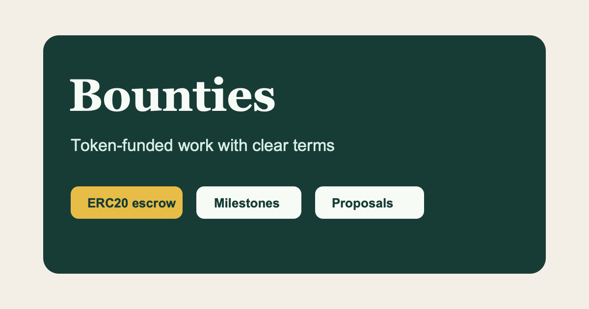

# Bounties

**Fund work. Deliver results.**

Bounties is an open-source, wallet-native marketplace for token-funded work. It
keeps the scope, proposals, milestone schedule, delivery evidence, participant
reputation, and ERC20 escrow record together from publication through payment.

[Open Bounties](https://bounties.bittrees.org/) ·
[Browse bounties](https://bounties.bittrees.org/marketplace) ·
[Create a bounty](https://bounties.bittrees.org/create) ·
[Discover profiles](https://bounties.bittrees.org/profiles)

[](https://bounties.bittrees.org/)

The marketplace application and public site are implemented and deployed.
Version 3 escrow contracts are deployed with matching runtime bytecode across
the supported test networks and mainnets. Mainnet value-bearing actions remain
fail-closed in the application until their separate audit, legal, security, and
operations release gates are approved. A contract deployment is never treated
as permission to activate production funds.

## Product highlights

### Marketplace

- Browse public bounties without connecting a wallet; connect only when taking
  an authenticated action.
- Publish work as a task, deliverable, milestone engagement, project,
  consultation, audit, or retainer.
- Define a precise budget, payment token, resources, acceptance criteria, and
  one to 32 ordered deliverables with absolute deadlines.
- Search and order opportunities by keyword, work type, category, status,
  network, and deadline using tile or list views.
- Submit proposals with a delivery plan and optional supporting material, then
  let the requester select a provider before escrow begins.
- Copy an existing public bounty into a new editable draft without copying its
  applicants, evidence, or transaction history.

### Profiles and reputation

- Publish a wallet profile with a display name, ENS identity and avatar, bio,
  website, optional public timezone, work types, and service categories.
- Discover participants by name, ENS, biography, work type, category, and
  recent completed activity.
- Keep requester and provider reputation separate: capital providers are rated
  on payment experience, while labor providers are rated on delivered work.
- Show completed marketplace activity, directional ratings, reviews, and
  author responses on public profiles.
- Allow profile owners to hide and later reactivate their public profile
  without deleting retained activity or reputation.

### ERC20 escrow

- Use exact integer base-unit accounting; native ETH is represented as WETH in
  this ERC20-only system.
- Fund the complete bounty up front or opt into exact sequential milestone
  funding for multi-deliverable work.
- Bind the accepted scope, milestone schedule, provider, evidence location, and
  provider-supplied SHA-256 content digest to canonical commitments.
- Record funding and lifecycle progress only after the server verifies the
  expected contract, network, receipt, events, participants, token, amount,
  commitments, and confirmation threshold.
- Preserve onchain truth when application data is delayed: database records
  describe escrow but never move funds or override the contract.

### Trust and safety

- Authenticate with Sign-In with Ethereum (EIP-4361), single-use five-minute
  challenges, opaque HttpOnly sessions, strict origin checks, and session-bound
  CSRF tokens.
- Inspect custom ERC20 contracts by network and address, including bytecode,
  metadata, decimals, supply, proxy/source status, collision warnings, and a
  direct block-explorer link.
- Treat token metadata as advisory. Exact sender, escrow, and recipient balance
  checks reject or fail closed on false-returning, fee-on-transfer,
  sender-taxed, and rebasing behavior.
- Let signed-in participants report listings, reviews, profiles, or suspected
  scam tokens. Authorized moderators can hide content in the hosted interface
  but cannot modify chain history or control escrowed funds.
- Keep moderation and governance decisions auditable through role-bounded,
  append-only records.

## How a bounty works

1. A requester publishes the work, budget, token, milestones, deadlines,
   resources, and acceptance criteria.
2. Providers submit proposals and supporting material. The requester selects
   one provider.
3. The requester creates and funds the matching escrow, either in full or with
   the exact first staged allocation.
4. The selected provider accepts onchain and submits delivery evidence for the
   active milestone.
5. The requester approves the delivery, requests the one permitted revision,
   or allows the seven-day review period to expire.
6. The active allocation is released. A staged bounty returns to funding for
   the next milestone; the final release closes the bounty.
7. After a released, settled, or partially completed escrow is freshly
   verified onchain, each participant may publish one directional review.

## Escrow lifecycle

```text
Created -> Funded -> ProviderAccepted -> Delivered -> BuyerApproved -> Released
    |          |              ^      |       |
    +----------+-> Cancelled  |      |       +-> Released after review expiry
               |              +-- Revision (once per milestone)
               +-------------> Refunded after a missed active deadline
               \----------------------------> Settled by bilateral exact split

Nonfinal staged release -> AwaitingFunding -> ProviderAccepted
                                      \-----> PartiallyCompleted if left unfunded
```

Important contract boundaries:

- The contract has no owner, administrator, pause key, arbiter, token allowlist,
  unilateral clawback, or dispute authority.
- The requester may cancel before provider acceptance. After acceptance,
  participant-controlled delivery, deadline, release, refund, and settlement
  rules determine the outcome.
- Each milestone permits one requester revision. The provider receives seven
  days to submit a different evidence commitment.
- A delivered milestone has a seven-day review period. After expiry, release is
  permissionless but always pays the selected provider.
- Either participant may propose an exact provider payout before final release;
  only the counterparty can accept it, and the remainder returns atomically to
  the requester.
- Direct token transfers are not credited to a bounty. Every funded or paid
  amount must reconcile exactly.

The full Solidity lifecycle, invariants, commitment formats, and reproducible
contract setup are documented in [contracts/README.md](contracts/README.md).

## Supported networks

| Network | Chain IDs | Deployment status |
| --- | --- | --- |
| Ethereum | Mainnet `1`, Sepolia `11155111` | v3 deployed; mainnet application actions remain separately gated |
| Base | Mainnet `8453`, Sepolia `84532` | v3 deployed; mainnet application actions remain separately gated |
| Robinhood Chain | Mainnet `4663`, Testnet `46630` | v3 deployed; mainnet application actions remain separately gated |

The exact addresses, deployment receipts, Safe authority, source-verification
records, validation blocks, and bytecode hashes are published in the
[testnet v3](contracts/deployments/testnet-v3.json) and
[mainnet v3](contracts/deployments/mainnet-v3.json) manifests. Application
feature flags and per-network configuration remain fail-closed unless an
operator explicitly enables a reviewed deployment.

Curated display presets include WETH, BTREE, BIT, WBTC, USDC, and USDT. Token
identity is always the network plus inspected contract address—never its symbol.
Other ERC20 contracts can enter through the same inspection boundary.

## Architecture

| Layer | Responsibility |
| --- | --- |
| React 19 + TypeScript + Vite | Responsive marketplace, wallet connection, profiles, moderation, and transaction preparation |
| Same-origin Vercel API | SIWE verification, sessions, CSRF, validation, chain inspection, rate limits, and allowlisted state transitions |
| Supabase Postgres | Accounts, profiles, roles, tokens, bounties, proposals, milestones, evidence, escrow observations, reviews, moderation, and notifications |
| Row-level security + server routines | Defense-in-depth authorization around the verified wallet account |
| viem/ethers escrow adapter | Versioned ABI boundary, canonical commitments, transaction preparation, receipt verification, and chain reads |
| Solidity 0.8.24 + Foundry | Permissionless `BountyEscrow` contract, unit tests, fuzz campaigns, and stateful invariants |
| Vercel | Production hosting, security headers, same-origin routing, and production migration authority |

The browser never receives a Supabase service-role key or trusts a caller-supplied
wallet address. It talks only to `/api/wallet-auth` and `/api/bounties/*` on the
site origin. The server derives identity from the signed-wallet session and
invokes a fixed set of routes and database routines. The retired Supabase
Functions remain HTTP 410 tombstones so there is no second authentication or
mutation implementation to drift.

Read [ADR 0001](docs/adr/0001-production-application-architecture.md) for the
complete wallet, persistence, permission, contract-adapter, and deployment
boundaries.

## Repository map

```text
src/App.tsx                 Product UI and browser journeys
src/auth/                   SIWE message construction and validation
src/chain/                  Network config, ABI boundary, commitments, and escrow adapter
src/persistence/            Same-origin browser client and domain mapping
src/server/                 Vercel-compatible auth, API, RPC, and rate-limit handlers
supabase/migrations/        Authoritative Postgres schema, routines, RLS, and audit controls
contracts/src/              Solidity escrow interface and implementation
contracts/test/             Unit, fuzz, milestone, malicious-token, and invariant tests
contracts/deployments/      Immutable deployment and verification manifests
public/                     Legal pages, search metadata, app icons, and social preview assets
docs/                       Architecture, local database, readiness, and launch documentation
```

## Local development

### Prerequisites

- Node.js and npm matching the repository lockfile
- Docker Desktop or another local Docker engine
- Supabase CLI for the local database
- Foundry only when working on the Solidity package

### Start the application

```bash
npm ci
cp .env.example .env.local
supabase start
supabase db reset
npm run dev
```

Use the local Supabase values printed by `supabase start` in `.env.local`.
Browser-visible `VITE_*` variables may contain public configuration such as a
verified contract address, but never put a service-role key, private RPC URL,
signer, mnemonic, or private key in one. See
[docs/local-supabase.md](docs/local-supabase.md) for migration authority and
local reset rules.

### Verify the application

```bash
npm run lint
npm test
npm run build
npm run audit
```

### Verify the contracts

After installing the pinned Foundry dependencies described in
[contracts/README.md](contracts/README.md):

```bash
cd contracts
forge fmt --check
forge build
forge test
```

No RPC endpoint, signer, fork, funded wallet, deployment, or broadcast is needed
for the local contract suite.

## Configuration and deployment

`.env.example` documents all supported server and public configuration. The
important groups are:

- `APP_ORIGIN`, `SUPABASE_URL`, and `SUPABASE_SERVICE_ROLE_KEY` for the
  same-origin application boundary.
- `CHAIN_<id>_RPC_URL`, `CHAIN_<id>_BOUNTY_ESCROW_ADDRESS`, legacy-address
  lists, and confirmation thresholds for server verification.
- `VITE_CHAIN_<id>_BOUNTY_ESCROW_ADDRESS` for reviewed public addresses used by
  wallet transaction preparation.
- `VITE_ESCROW_*_ENABLED` flags for the global boundary, creation, pre-acceptance
  cancellation, and staged milestone funding.
- Mainnet BIT settings for the optional paid token-verification request flow.

Production Vercel builds are the sole remote migration authority. Preview and
development deployments skip migrations. Production migrations run under a
transaction advisory lock and are recorded in `public.app_schema_migrations`.
Do not run `supabase db push` against the hosted production database.

Search, social sharing, and install surfaces are published with route-specific
canonical metadata, structured data, `robots.txt`, `sitemap.xml`, a web app
manifest, synchronized favicon/app icons, and a 1200×630 social preview. Product
terms are available at `/terms`, acceptable-use rules at `/acceptable-use`, and
the privacy notice at `/privacy`.

## Release boundary

The application, database boundary, and v3 contracts are implemented. Enabling
real-value mainnet activity still requires the immutable evidence packet defined
in [escrow production readiness](docs/escrow-production-readiness.md), including:

- specification freeze and contract hardening;
- independent security audit and remediation;
- legal/compliance approval;
- complete testnet-v3 lifecycle rehearsal and soak;
- monitoring, incident response, and rollback readiness; and
- a separate per-network production canary decision.

These gates are deliberate product behavior, not unfinished UI. Until they pass,
mainnet transaction controls remain hidden and fail closed.

## Contributing and security

Read [CONTRIBUTING.md](CONTRIBUTING.md) before proposing a change. A useful
marketplace issue includes the scope, budget/token, requester authority,
resources, acceptance criteria, and expected delivery evidence.

Report security issues privately as described in [SECURITY.md](SECURITY.md).
Never publish a service-role key, RPC secret, private key, mnemonic, session
token, or funded deployment command.

## License and credit

Bounties is released under the [MIT License](LICENSE). The escrow/bounty concept
was informed by `stigmergic-org/simplebounty`; this repository is an independent
Bittrees marketplace implementation with a broader end-to-end service workflow.
